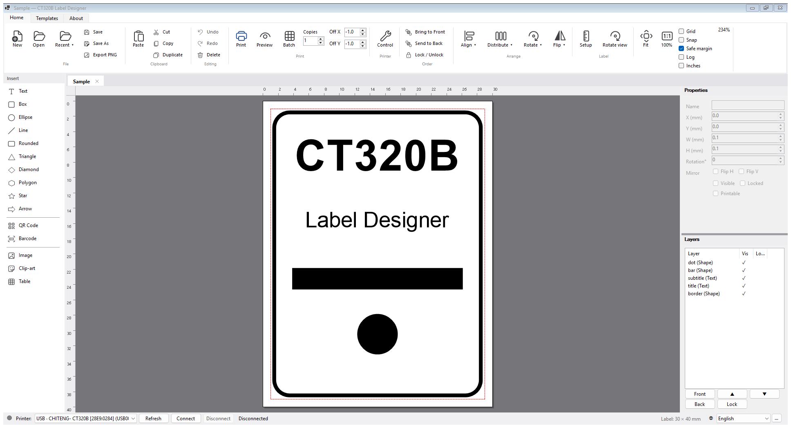
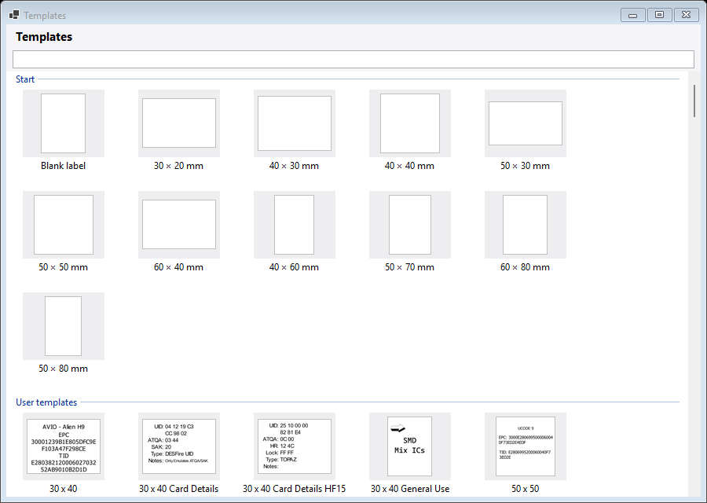
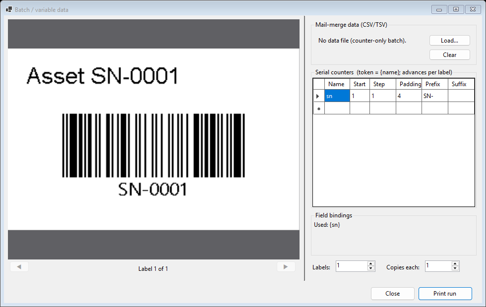
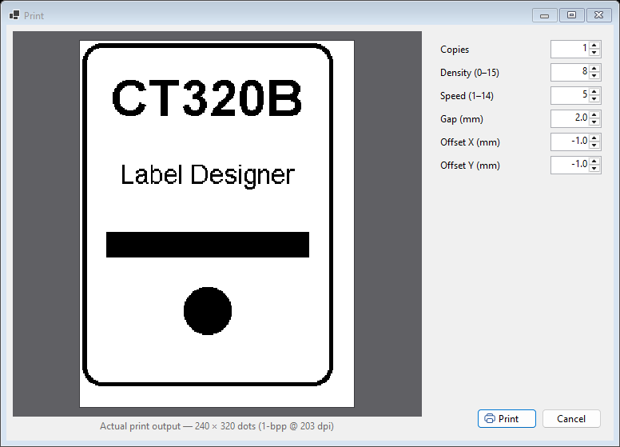
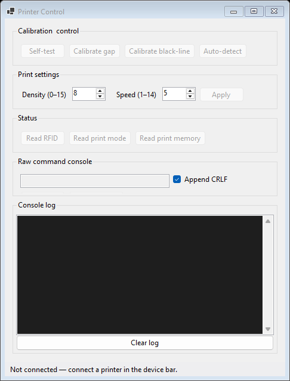
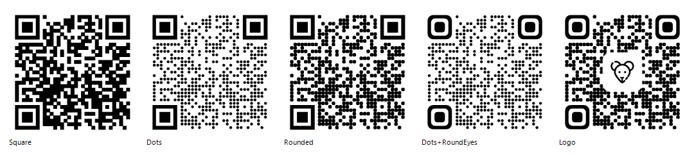
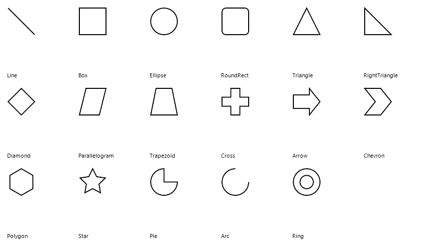
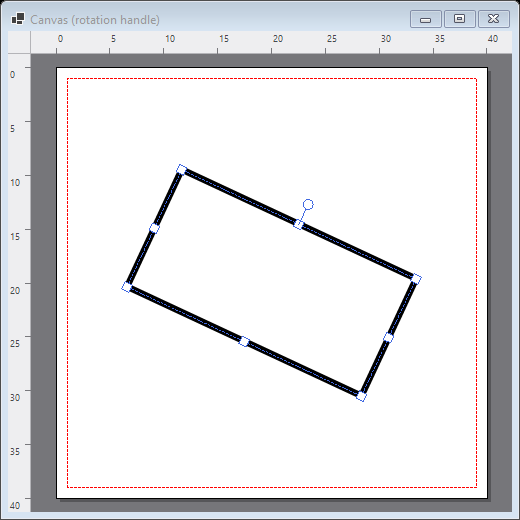
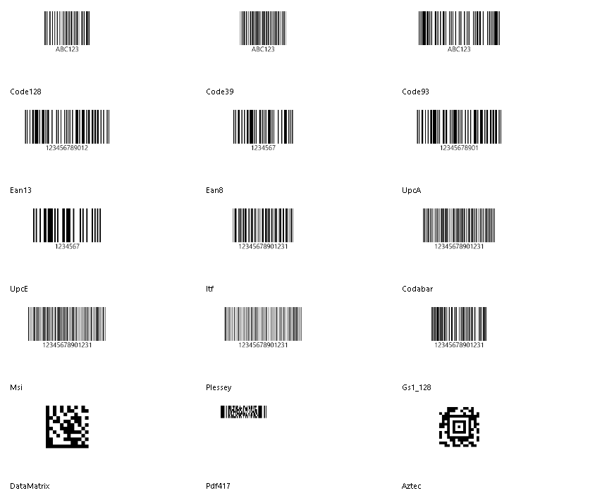

# CT320B Label Designer

A WinForms **label-design studio** for the CT320B thermal sticker printer, built on a pure-C# (.NET 10)
port of the printer's `USBApi.dll` + `BluetoothCore.dll`. Design labels on a WYSIWYG canvas and print
them over **USB or Bluetooth** — the rendered label is the exact 1-bpp bitmap the printer marks.



## Features

**Design canvas** — drag, resize, and **free-rotate** elements (rotation handle), snap-to-grid, smart
**alignment + equal-spacing guides**, multi-select, group/ungroup, layers, undo/redo, copy/paste, zoom/pan,
rulers, and a view-rotate for working on spun labels.

**Elements** — text (auto-fitting), **17 shapes** (incl. stars/arrows/polygons/pie), images, a bundled
**clip-art library**, tables, **QR codes** (with styled module/eye shapes and an optional centre logo), and
**15 barcode symbologies** (Code 128/39/93, EAN/UPC, ITF, Codabar, MSI, Plessey, GS1-128, DataMatrix,
PDF417, Aztec).

**Variable data & batch** — serial counters and CSV/TSV mail-merge via `{token}` placeholders, with a live
batch preview; one render per row through the validated print path.

**Templates** — a New-label gallery with common blank sizes, saved labels, importable Clabel **`.ddl`**
templates, and drop-in pre-printed backgrounds.

**Printing** — a true 1-bpp **WYSIWYG print preview**, per-printer offset calibration, a printer
**control panel** (self-test, gap/black-line calibration, density/speed, RFID/status reads, raw console),
USB hot-plug auto-reopen, and Bluetooth.

**Polish** — multi-document tabs, PNG export, auto-save & crash recovery, non-modal toast/log,
**mm ⇄ inch** units, a responsive ribbon, and **six UI languages** (English, 中文, Español, Deutsch,
Français, Bahasa Melayu) that are user-extensible by dropping a JSON file in the `lang` folder.

## Screenshots

| New-label gallery | Variable data / batch |
| --- | --- |
|  |  |

| Print preview (true 1-bpp) | Printer control |
| --- | --- |
|  |  |

| Styled QR codes | Shapes |
| --- | --- |
|  |  |

Free rotation on the canvas, and the full barcode set:




## Quick start

Requires the **.NET 10 Desktop Runtime** on Windows.

```bat
build.bat            :: builds the app into bin\Release  (build.bat Debug for Debug)
```

Or with the SDK:

```
dotnet run --project src/CT320B.LabelDesigner      # launch the designer
dotnet build CT320B.slnx                           # build everything
```

Connect a printer from the **device bar** at the bottom (USB or a paired Bluetooth printer), design a
label, then **Print** (or **Preview** / **Batch**).

## Adding a language

Every UI language is a file in `lang/` beside the exe — `<code>.json` with a `name` and a `strings` map.
Copy `en.json`, translate the values (missing keys fall back to English), drop it back in (the picker's
**…** button opens the folder), and restart. The picker is at the bottom-right of the device bar.

## Project layout

```
src/
  CT320B.UsbApi/             USB/Bluetooth transport, TSPL/CPCL builders, rasterizer, status codec
  CT320B.LabelDesigner.Core/ model + renderer + serialization + print job + variable-data + codecs (testable)
  CT320B.LabelDesigner/      the WinForms app (ribbon, canvas, dialogs, services)
```

---

# The CT320B protocol & library

`CT320B.UsbApi` is a pure-C# (.NET 10) port of the printer's control libraries (`USBApi.dll` +
`BluetoothCore.dll`). It enumerates and drives the printer over **USB** and **Bluetooth (RFCOMM)** with one
transport-agnostic API, generating **TSPL** command bytes verified byte-for-byte against the original
software and **validated on real hardware**. The library stands alone — the designer is just one consumer.

> **Usage guides:** [`docs/usb_api.md`](docs/usb_api.md) and [`docs/bluetooth_api.md`](docs/bluetooth_api.md)
> walk through the C# library over each transport. **[`docs/PROTOCOL.md`](docs/PROTOCOL.md)** is the full
> wire-protocol reference (commands, label sequence, BITMAP raster, status/RFID).

## Print a label

```csharp
using System.Drawing;
using CT320B.UsbApi;

// Render whatever you want onto a bitmap sized for your label content.
using var image = new Bitmap(224, 280);
using (var g = Graphics.FromImage(image))
{
    g.Clear(Color.White);
    g.DrawRectangle(new Pen(Color.Black, 3), 4, 4, 216, 272);
    g.DrawString("CT320B", new Font("Arial", 24, FontStyle.Bold), Brushes.Black, 16, 18);
}

using var printer = CT320BPrinter.OpenFirstUsb();                 // first USB printer
printer.PrintImageLabel(image, widthMm: 30f, heightMm: 40f, x: 8f, y: 8f);
```

`PrintImageLabel` emits the exact sequence the real driver uses: the `SET RIBBON OFF` + `SET …` preamble,
double `CLS`, an inverted 1-bpp `BITMAP` (TSPL convention) at `ceil(w/8)` stride, then `PRINT`. `x`/`y`
(in dots, 8 dots/mm @ 203 dpi) position the content. **Bluetooth is identical** — same facade, same
commands — once the printer is paired in Windows:

```csharp
using var printer = CT320BPrinter.OpenFirstBluetooth();          // name starts "CT"
// using var printer = CT320BPrinter.OpenBluetooth("32:51:24:27:87:99");
printer.PrintImageLabel(image, 30f, 40f, x: 8f, y: 8f);
```

## Enumerate, commands & status

```csharp
foreach (var p in UsbPrinterEnumerator.Enumerate())
    Console.WriteLine(p);   // USB Printing Support [VID_28E9&PID_0284] \\?\usb#...
foreach (var d in BluetoothDiscovery.Discover())
    Console.WriteLine(d);   // CT320B-G28T [32:51:24:27:87:99] paired

printer.SetPaperSize(30f, 40f, "mm");
printer.SetDensity(8);
printer.Clear();
printer.DrawQRCode(10, 20, "https://example.com");
printer.DrawRectangle(10, 10, 230, 310, 3);
printer.Print();

byte[]? rfid = printer.ReadRfidData();      // null if no tag/module
printer.SendRaw("SELFTEST\r\n"u8);           // escape hatch

printer.DownloadImage("LOGO.BMP", logo);     // store in flash …
printer.PrintStoredBitmap("LOGO.BMP", 5, 95);// … and recall it (DOWNLOAD / PUTBMP)
printer.EnableUsbHotPlugReopen();            // auto-reopen on re-plug
```

An async Bluetooth client (scan/connect/send + receive loop, surfaced as .NET events) is also provided:

```csharp
using var bt = new BluetoothPrinterClient();
bt.DeviceDiscovered += d => Console.WriteLine(d);
await bt.ConnectByNameAsync("CT320B");
bt.Printer!.PrintImageLabel(label, 30f, 40f);
```

## Architecture

The protocol/imaging core is transport-agnostic; USB and Bluetooth are just `IPrinterTransport`s.

```
CT320BPrinter (facade)
  ├── Transport/        IPrinterTransport → UsbPrintTransport (overlapped CreateFile)
  │                                       → RfcommTransport  (AF_BTH socket)
  │                                       → FileCaptureTransport (debug sink)
  ├── Enumeration/      UsbPrinterEnumerator (SetupAPI) · BluetoothDiscovery (BluetoothFind*)
  ├── Imaging/          MonochromeRasterizer (1-bpp, gray=(R+G+B)/3, threshold 128)
  ├── Protocol/         Tspl/TsplCommandBuilder · Cpcl/CpclCommandBuilder · Status/{Crc8,StatusCodec}
  ├── Bluetooth/        BluetoothPrinterClient (async scan/connect/send + recv loop, .NET events)
  └── Native/           SetupApi · Kernel32 · WinsockBth · BluetoothApis · DeviceNotification (hot-plug)
```

## Protocol gotchas (learned the hard way; see [`docs/PROTOCOL.md`](docs/PROTOCOL.md))

- This printer is **TSPL** (USB `VID_28E9&PID_0284`), despite some app templates being labeled CPCL.
- A label **must** begin with `SET RIBBON OFF` (direct thermal) and the `SET PEEL/CUTTER/TEAR…` preamble —
  without it the printer won't mark (and unsupported commands like `BOX`/`QRCODE` mixed into a job can
  fault/power-cycle the unit). This is why the designer renders the whole label to a bitmap and prints it
  through the one known-good sequence, so **preview == print**.
- `BITMAP` raster is standard TSPL convention (**bit 0 = black**, 1 = white) — the inverse of the DLL's
  internal `Bmp2Bytes`; `TsplCommandBuilder.PrintBitmap` inverts for you.
- `BITMAP` width is **`ceil(width/8)` bytes** (not DWORD-aligned).

## Licenses

The app bundles third-party assets, attributed in [`NOTICE.txt`](NOTICE.txt): Fluent UI System Icons (MIT),
ZXing.Net (Apache-2.0), and Svg.NET (MS-PL).
